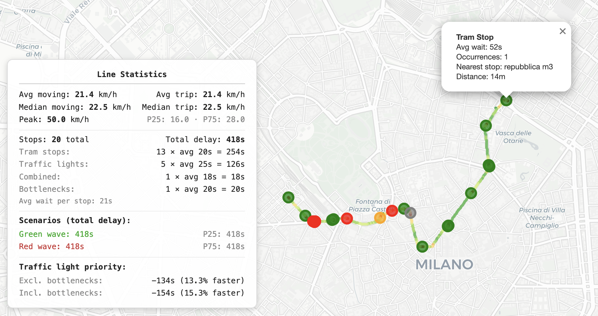

# 🚋 Velotrack

<p align="center">
  
</p>
<p align="center"><strong>🚋 Try Velotrack:</strong> <a href="https://velotrack.pensamiciclabile.it/">velotrack.pensamiciclabile.it</a></p>

Analyze GPS recordings of tram rides in Milan to produce interactive maps with velocity heatmaps and classified stop events.

Record your tram rides with any GPS tracking app, drop the GPX files into the project, and Velotrack will generate an HTML map showing how fast the tram moved along the route and where it stopped — distinguishing between tram stops, traffic lights, and bottlenecks.
It also aggregates multiple rides on the same line to produce average speed and wait time maps, and provides a statistics panel with insights on potential improvements like traffic light priority and other interesting insights.
In addition to line-by-line analysis, the site now builds a cross-line infrastructure view ("Network hotspots") with one aggregate per physical location, plus nested breakdowns by time band and by contributing lines.

---

> **For 🇮🇹 speakers:**
> Questo è parte di un progetto in collaborazione con [Velocipiedi](https://velocipiedi.it), un progetto di divulgazione italiano sulla mobilità e l'urbanistica.
> Qualche mese fa hanno lanciato [TRAMsformaMi](https://velocipiedi.it/tramsformami/), una campagna rivolta al comune di Milano per chiedere il potenziamento dei mezzi pubblici di superficie.
> Velotrack nasce come tool open-source che ho sviluppato per analizzare i dati GPS delle corse in tram a Milano, con l'obiettivo di produrre mappe interattive che mostrano le velocità e i tempi di attesa lungo le linee del tram.
> I dati che nel futuro arriveranno grazie alla community di [Velocipiedi (instagram)](https://www.instagram.com/velocipiedi/) e [PensamiCiclabile (instagram)](https://www.instagram.com/pensamiciclabile/) potranno essere analizzati con Velotrack per identificare i problemi più urgenti e supportare le richieste di miglioramento del servizio.
> L'intero processo è open source, in modo che chiunque può contribuire, esaminare e replicare i risultati, garantendo il massimo livello di trasparenza possibile.

---

## How it works

The GPS tracking app stops recording points when you're not moving, creating time gaps in the data. Velotrack exploits this: a **stop** is any gap longer than 5 seconds where the tram moved less than 15 meters. Each stop is then classified by proximity to known tram stops (from Milan's official GTFS data) and user-provided traffic light locations.

**Stop categories:**
- **Tram stop** — within 30m of a GTFS tram stop
- **Traffic light** — within 25m of a known traffic light
- **Combined** — near both a tram stop and a traffic light
- **Bottleneck** — none of the above (congestion, intersections, etc.)

**GPS track snapping:** Raw GPS traces have 5–10 m of inherent inaccuracy. Before analysis, each ride's points are snapped to the corresponding tram line's track geometry from OpenStreetMap (`railway=tram` ways). Snapping uses a forward-chain continuity bonus so points stay on the same track through junctions and parallel tracks. Only lat/lon are updated for map visualization — original distances and velocities are preserved to maintain smooth acceleration curves.

**Teleport filter:** GPS receivers can lose lock and produce "teleport" artifacts — points that bounce back and forth over hundreds of meters. These are automatically detected using a sliding window that compares cumulative distance to net displacement: if the ratio exceeds 5×, those points are removed and the polyline breaks cleanly at the gap.

**Velocity outlier removal:** GPS jitter can produce unrealistic speed spikes. Velocities above the configured max (default 50 km/h) are clamped before computing statistics or rendering the heatmap.

When multiple rides share the same tram line, wait times and velocities are averaged.

Velotrack uses a **hybrid analytics model**:
- **Line-level stats** stay line-specific (used for line pages/cards and scenario KPIs)
- **Location-level stats** are aggregated globally across lines and exported to `site/data/location_stats.json` (used by the Network hotspots map-first view)

**Line statistics panel:** Each generated map includes a summary panel (bottom-left corner) with:
- **Speed stats** — moving and trip-level averages, median, peak, P25/P75
- **Stop breakdown** — count and total wait time per category (tram stops, traffic lights, combined, bottlenecks)
- **Scenario analysis** — green wave (estimated time saved if all traffic light stops were automatically switched to green when the tram approaches), red wave (sum of max wait at each location), and P25/P75 totals

## Quick start

```bash
# 1. Place your GPX files in data/rides/
#    (tram stop data is already included in data/tram_stops.csv)
#    Naming convention: line<N>_<destination>_<description>.gpx
#    Example: line1_roserio_repubblica_xxsettembre.gpx

# 2. Download OSM tram track geometry (one-time, for GPS snapping)
uv run main.py download-osm

# 3. (Optional) Add traffic light locations
uv run main.py template          # creates data/traffic_lights.csv
# Edit the CSV with lat, lon, name, notes

# 5. Generate maps
uv run main.py analyze

# 6. Open the result
open outputs/line1_roserio.html
```

### Build the website

To generate a full static site (home page, line comparison, detail pages, hotspots):

```bash
uv run main.py build-site
open site/index.html
```

Main outputs generated by `build-site`:
- `site/index.html` — home page
- `site/lines/*.html` — line detail pages
- `site/maps/*.html` — interactive map iframes
- `site/hotspots.html` — cross-line infrastructure hotspots view
- `site/data/lines.json` — line stats JSON
- `site/data/location_stats.json` — global location-level stats JSON (one row per physical hotspot)

`site/hotspots.html` is map-first: filters are `category` + `time band`, the map always shows all filtered hotspots, and the ranked list (top 20) can be used as a radio selector to focus/open a hotspot popup.

### Hotspots JSON shape (`site/data/location_stats.json`)

Each hotspot record contains:
- `location_key`, `lat`, `lon`, `category`
- overall metrics: `obs_count`, `mean_wait_s`, `median_wait_s`, `p25_s`, `p75_s`, `min_s`, `max_s`
- `time_bands`: per-band metrics object (`obs_count`, `mean_wait_s`, `median_wait_s`, ...)
- `lines`: per-line contributions with destination labels (`line_number`, `direction_name`, `label`, `obs_count`, `mean_wait_s`, `time_bands`)
- `line_keys`, `line_count`

The site is also built and deployed to GitHub Pages automatically on every push to `main`.

You can also analyze specific files:

```bash
uv run main.py analyze data/rides/line1_roserio_repubblica_xxsettembre.gpx
```

### Inspect individual rides

To visually check a GPX recording for corrupted segments before including it in the analysis:

```bash
uv run main.py inspect data/rides/line1_roserio_repubblica_xxsettembre.gpx
```

This generates a point-by-point map in `outputs/` where each GPS point is color-coded by speed. Hover over any point to see its index, timestamp, lat/lon, speed, and cumulative distance. The console prints a clickable `file://` URL to open the map directly. Use the point indices to identify corrupted sections to delete from the source GPX file.

## Managing data

### Recording GPX rides

To get accurate data, follow these rules when recording a tram ride with your GPS app:

1. **Start tracking before the tram departs**: begin recording as soon as the tram arrives at your stop, while you are still standing outside. This captures the real departure time and avoids cutting off the first segment.
2. **Stay still inside the tram**: do not walk around. Movement inside the vehicle adds GPS noise and creates false speed readings. Try to sit or stand in one spot for the entire ride.
3. **Stop tracking after the tram stops**: wait until the tram has come to a full stop at your destination before ending the recording. This ensures the final stop is captured correctly.
4. **Use a high recording frequency**: set your GPS app to record a point every 1 second if possible. Lower frequencies (e.g. every 5s) may miss short stops.
5. **Keep your phone near a window**: GPS signal is stronger near windows. Avoid keeping the phone deep in a bag or pocket, especially in older trams with metal bodywork.

### GPX file naming

Place `.gpx` files in `data/rides/`. The filename determines which tram line the ride belongs to:

```
line1_roserio_repubblica_xxsettembre.gpx          → Line 1 — Roserio
line10_p.za-ventiquattro-maggio_notte.gpx         → Line 10 — P.za Ventiquattro Maggio
line14_lorenteggio_morning_rush.gpx               → Line 14 — Lorenteggio
```

The pattern is `line<N>_<destination>_<description>.gpx`. The destination is the terminus the tram is heading towards (use hyphens for multi-word names, e.g. `p.za-castelli`). Files that don't match this pattern are processed individually. Multiple rides on the same line and destination are grouped and averaged in the output map.

To remove a ride, delete the GPX file and re-run `uv run main.py analyze`.

### Traffic lights

Edit `data/traffic_lights.csv` to add known traffic light positions:

```csv
lat,lon,name,notes,added_at,added_by
45.4781,9.1897,Corso Buenos Aires / Via Pecchio,often long wait,2026-03-04T12:54:45.437245+00:00,daniel
```

This is optional — without it, stops near traffic lights will be classified as bottlenecks instead.

To view all traffic lights on an interactive map:

```bash
uv run main.py traffic-lights
open outputs/traffic_lights.html
```

(**recommended**) For an interactive workflow — right-click on the map to add traffic lights directly:

```bash
uv run main.py traffic-lights --watch
```

With `--watch`, a local HTTP server starts at `http://localhost:8000`. The map includes a Google Satellite + Labels layer (toggle in top-right) for easy identification. Right-click anywhere on the map to open a popup form — enter a name (required) and optional notes, then click "Add". Click any existing red-dot traffic light to remove it. The page reloads automatically after add/remove. Each added entry is timestamped (`added_at`) and tagged with your local username (`added_by`) in the CSV.

### Tram stop data

Tram stop locations are stored in `data/tram_stops.csv` (committed to git). This file ships with the project, so you don't need to download anything to get started.

To refresh the data from [Milan's open data portal](https://dati.comune.milano.it/dataset/ds929-orari-del-trasporto-pubblico-locale-nel-comune-di-milano-in-formato-gtfs), run `uv run main.py download-gtfs`. This downloads the full GTFS dataset (~330MB) into `data/gtfs/` (gitignored), extracts the tram stops, and overwrites `data/tram_stops.csv`.

You can also provide your own `tram_stops.csv` for a different city — just use columns: `stop_id`, `stop_name`, `lat`, `lon`.

## Testing

Run the test suite:

```bash
uv run python -m unittest discover -s tests -v
```

This covers:
- location-event normalization and cross-line aggregation
- hotspot ranking/filter semantics by category and time band
- map statistics edge cases (degenerate rides)
- site build integration for hotspots and `location_stats.json`

## Contributing

See [contribute.md](contribute.md) for architecture, data flow, test strategy, and extension guidelines.

## Project structure

```
velotrack/
  main.py                  # CLI entry point
  velotrack/
    config.py              # thresholds, paths, colors
    gpx_parser.py          # GPX → DataFrame with velocity, teleport filter
    stop_detector.py       # detect + classify stops
    gtfs.py                # download/parse GTFS tram stops
    osm_tracks.py          # download OSM tram tracks, snap GPS to tracks
    map_builder.py         # folium map generation
    location_analytics.py  # normalized stop events + global location stats
    site_builder.py        # static site generation (Jinja2)
  templates/               # Jinja2 templates for the website
    hotspots.html          # network hotspots page
    static/css/style.css
    static/js/main.js
  tests/                   # unit/integration tests (unittest)
  data/
    rides/                 # your GPX files go here
    tram_stops.csv         # cached tram stop locations (committed)
    traffic_lights.csv     # user-provided traffic light locations
    osm_tracks.json        # cached OSM tram track geometry (committed)
    gtfs/                  # raw GTFS download, gitignored
  outputs/                 # generated HTML maps, gitignored
  site/                    # generated static website, gitignored
```
